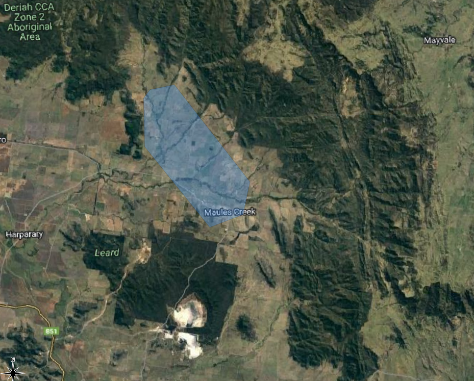
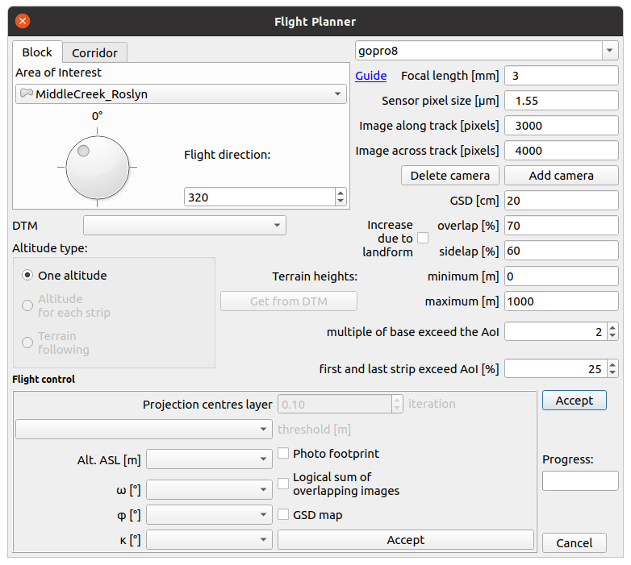
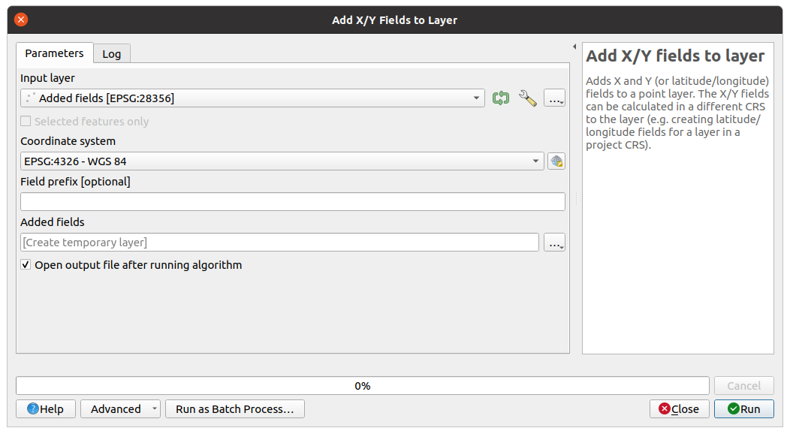
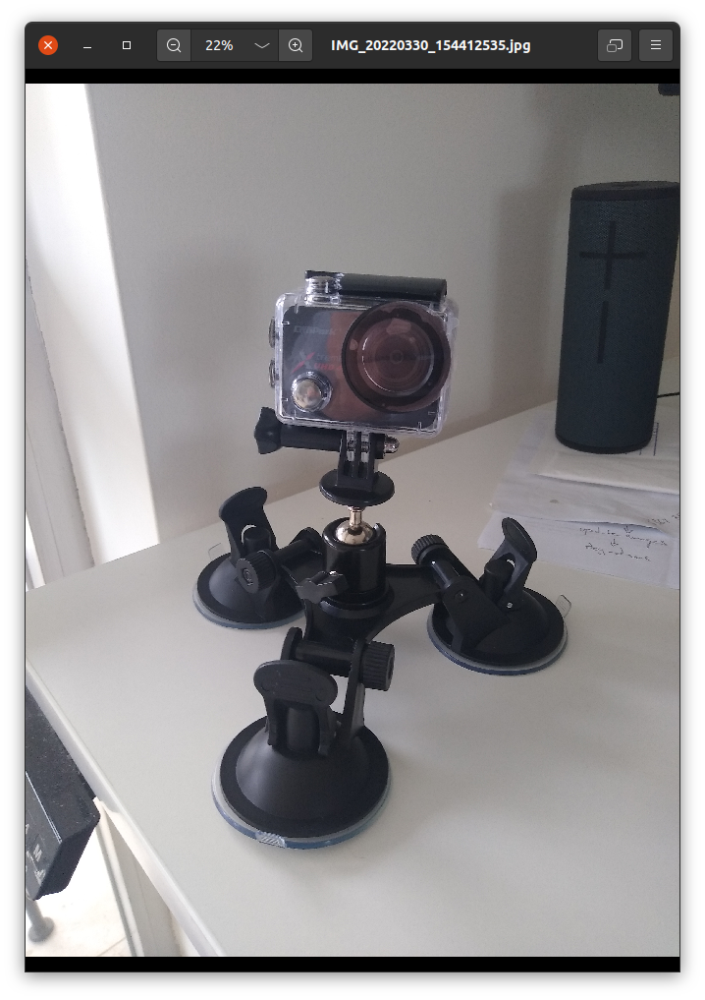
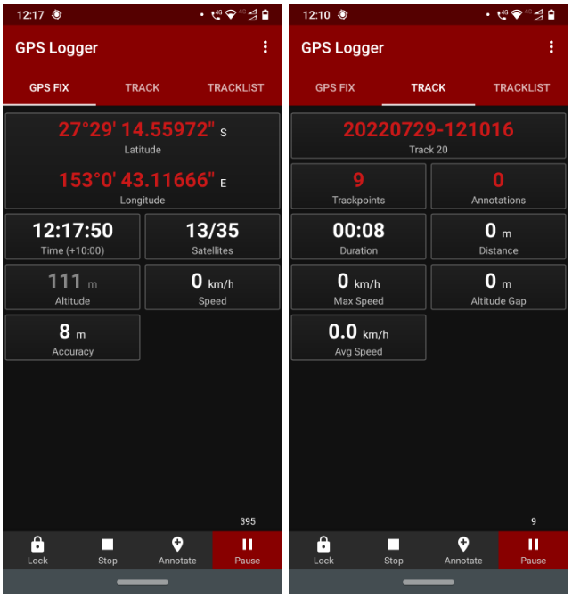
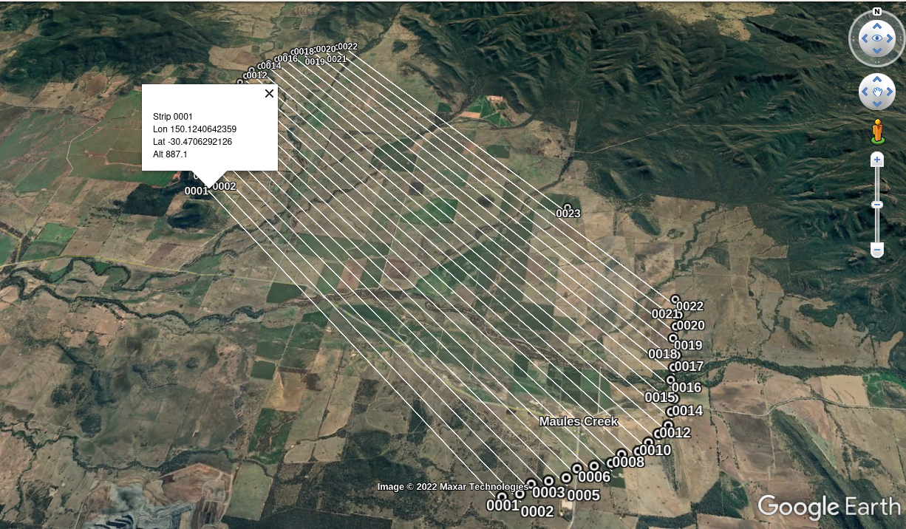
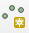
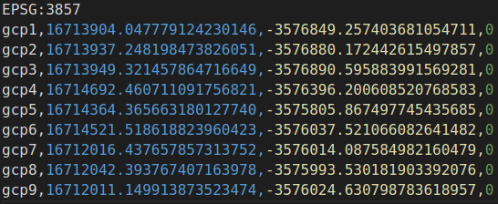
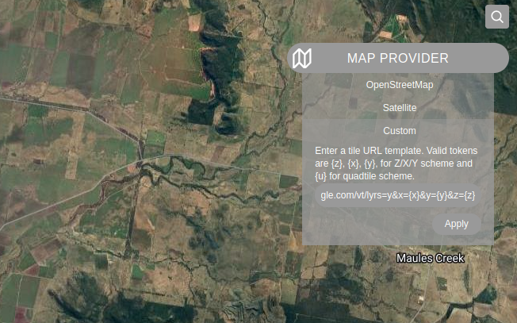
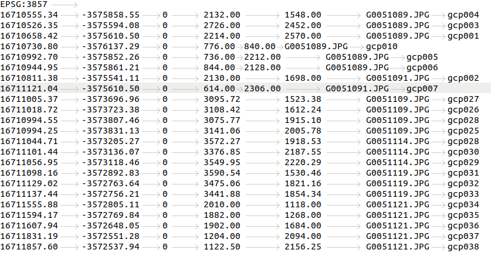

# Project Workflow

Project to create an ortho image using GoPro images captured from light aircraft. The Gopro is mounted below the wing. A android device running the GPS Logger app is located on the dash.

- Create the flight plan using QGIS Flight Planner and create a kml to load into Google Earth. The flight plan can be followed in the cockpit in real time

- Carry out the flight plan and capture images with the GoPro

- Extract the GPS waypoints from the GPS logger and update the Gopro images Exif fields

- Run WebODM with the updated Gopro images to create the ortho rectified image

- Add the images to Google Earth

# Step 1

## Create The Flight Footprint with QGIS Plugin
- In QGIS, create Flyover Footprint (Area of Interest)
- Create the “Flight Plan Area” shape for the Area of Interest (AOI), with the QGIS polygon tool  

- Right Click on the new AOI layer to;
    - Make Permanent the AOI layer to a ESRI Shapefile. 
    - Select Properties → symbology to change the color and opacity
    - Ensure all fields are ticked and that CPRS is set to EPSG:28356
- Create a Group and move the new Shape into the Group

## Convert the Footprint to a Flight Plan
- Use the QGIS Flight Planner Plugin settings below to create the new photos and photo centres layers

 
 
 
 - The plugin creates new "photos" and "photo projections" scratch layers
    • Make Permanent the “photos” layer to a ESRI Shapefile. 
        ◦ Ensure all fields are ticked
        ◦ That CPRS is set to EPSG:28356
        ◦ Save to new flyover directory
    • Export the “projections centre” layer to a ESRI Shapefile. 
        ◦ Ensure all fields are ticked. 
        ◦ That CPRS is set to EPSG:28356
        ◦ Save to its own empty directory

## Convert the Photo Centres to a Flight Plan

    • In QGIS add columns for decimal lon, lat
    • Processing → Toolbox → Vector table-→ Add X/Y → run

    • Right Click on the new “Added Fields” layer to check for decimal longitude and latitude 
    • Make Permanent the Added Fields Layer to a ESRI Shapefile. 
        ◦ Ensure all fields are ticked. 
    • Copy the new coordinates file “AddedFields.dbf” to vm-docker 
    • Run make_flight_plan.py to create the kml file for the flight plan 
    • Drop and Drag the file “FlyoverWaypoints.kml” into Google Earth

# Step 2
## Carry out the flight plan and capture images with the GoPro

- At the airfield 
    - mount the gopro to the underside of the wing using a suction mount

    - start the GPS Logger app and locate the device on the dash of the aircraft. Ensure that;
        - the time has been syncronised between the android device and the Gopro camera
        - the device has visibility to all available satellites

Notes:

- the above image shows 13/35 satellites and 8m accuracy when checking the app was functioning in the cockpit
- However once the device was put on the dash, according to the gpx file the device could see between 16 and 22 satellites. This according to the app improves accuracy to 3m

# Use Google Maps with the flight plan layer created in Step 1 to fly the plan

Notes:

    - Gopro photo min delay is set to 3 sec
    - Lowest Speed is approx 140 km / hr
    - At 150 km/hr, the  distance per second = 150,000 / 36000 = 41m / sec
    - Therefore at 150 km / hr, photos centres will be 123m apart
    - This allows calculation of total photo storage required for the flight (incl ferry time) 

# Step 3 
## Extract the GPS waypoints from the GPS logger and update the Gopro images Exif fields

Back in the office;
- Save the images from the Gopro to the computer hard drive
- Download the GPS Logger waypoint file to the hard drive
- Update the directory location of the saved images and the filename of the GPS waypoint file in make_layer_files.py
- Run make_layer_files.py
- Optional Cehck for blurry photos using delete del_blurry_img.py. this will move files into a 'blurry' subdirectory and create a kml with gpps points of the photos removed

Note: make_layer_files.py uses the timestamp of the waypoint and the image to update EXIF record in each image

# Step 4 
## Creating Ground Control Points (GCP) to use with WebODM

## Create GCP in QGIS
Great Primer here on the benefits of 'fake' GCP's 
https://youtu.be/0oXkQaccCRc

In QGIS create a Shapefile. 
 - Layer → Create Layer  → New Shapefile Layer

Now create the GCP points in the Shapefile
 - Highlight the new Shapefile layer
 - Click on editing mode     then click on points   
 - **Click on high contrast points. At least 3 points in 5 photos, depending on the number of images to be processed**         
 - When finished adding GCP's --> Right Click on the layer and Click on Save Layer Edits to create a new layer “Added geom info”
 
*Or use the field calculator to add the x and y fields*

Add gps data to the newly created Shapefile
 
 - Right Click on “Added geom info” layer → Export → ESRI Shapefile → gcp_add_geom.shp
 - Right Click on “Added geom info” layer → Export → CSV
   - Add file name gcp_points.csv, 
   - Click Geometry change Automatic to Point
   - Change the CRS. To the Project CRS e.g. EPSG:3857
   - Click OK

 - Edit the csv file to the GCP text file format
 - Find the gcp_points.csv file and copy it to gcp_file.txt.  
 - Edit the file to look like the layout below

          
 
*Note: If gcp_file.txt includes gcps that are outside the images to be loaded into WebODM, it will fail. Use make_gcp.py to create a new file with only the gcps that map to the images in the sub-directory to be loaded.*

## Map the GCP's in WebODM's GCP Editor

Good content on this process here --> https://youtu.be/axuVvRU8t54

Open WebODM Dashboard → GCP Interface
 - Customise the maps base layer 

   

   - On the Map area Select the Map Provider → Custom and enter the link → https://mt1.google.com/vt/lyrs=y&x={x}&y={y}&z={z}
   - Click Apply.  Minimise the Map Provider Box

Add the GCP's and Images to the GCP Editor
 - Drag the gcp_file.txt to the area marked Load Existing Control Points
 - Click on “Load”
 - Drag the selected photos to the area marked Select Photos
 - Work through the gcps in the list → https://www.youtube.com/watch?v=5CEiyAn2J2s ,  https://www.youtube.com/watch?v=5CEiyAn2J2s
 - Open each photo and create the GCP’s from Google Earth
 - Export the GCP’s often and then compile the final file at the end gcp_file.txt.
 - Select the gcp_file.txt with the images when loading the images for the WebODM run

The file will look like;

# Step 5
## Run WebODM with the updated Gopro images 

- Run the docker-compose.yml to create WebODM i.e. docker-compuse up -d
- Go to https://community.opendronemap.org for a great community with help and advice to stitch the images together

# Step 6
## Break the geotif into tiles for memory efficient loading over the internet

- Install gdal --> https://mothergeo-py.readthedocs.io/en/latest/development/how-to/gdal-ubuntu-pkg.html
- make a directory to contain the image pyramid
- run gdal2tiles  on the geotif python --> './venv/bin/gdal2tiles.py '/home/admin/dockers/ODM/mine1/Maules-Creek-Mine-03-08-2022-orthophoto.tif' '/home/admin/dockers/ODM/mine1/gmtiles/' -p geodetic -k'
- this will create a directory structure and a kml file doc.kml that can be dropped into Google Earth

# Step 7
## Load the kml tiles into Google Earth
- Save the image pyramid directory from Step 6 to a place accessible to Google Earth
- Start Google Earth
- Open the folder where the doc.kml file resides
- Click on doc.kml and drag it onto the Google Earth Canvas
- Google Earth should rotate to the area of interest and open the top images in the pyramid

# Step 8
## Load the geotif to Google Maps

https://developers.google.com/maps/documentation/javascript/customoverlays#typescript_5
https://developers.google.com/maps/documentation/javascript/examples/maptype-image-overlay