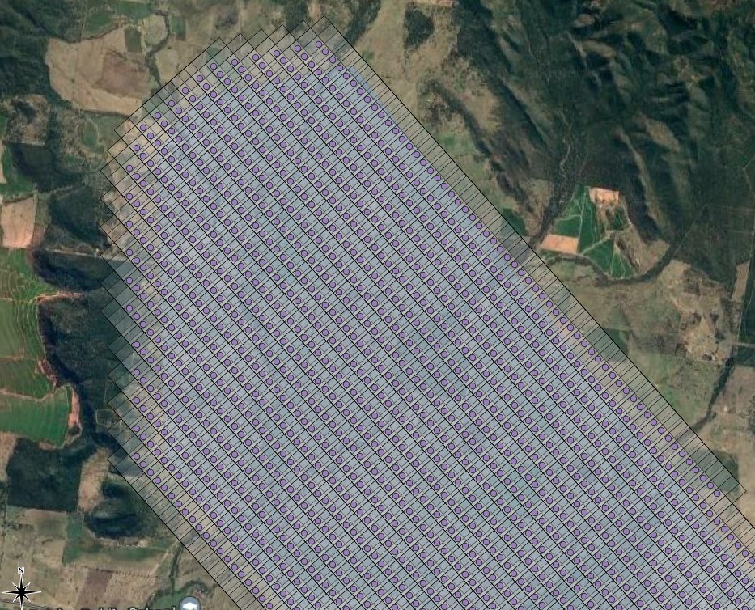

# Project Workflow

Project to create an ortho image using GoPro images captured from light aircraft. The Gopro is mounted below the wing. A android device running the GPS Logger app is located on the dash.

Step 1: Create the flight plan using QGIS Flight Planner and create a kml to load into Google Earth. The flight plan can be followed in the cockpit in real time

Step 2: Carry out the flight plan and capture images with the GoPro

Step 3: Extract the GPS waypoints from the GPS logger and update the Gopro images Exif fields

Step 4: Run WebODM with the updated Gopro images to create the ortho rectified image

# Step 1

## Create The Flight Footprint with QGIS Plugin
- In QGIS, create Flyover Footprint (Area of Interest)
- Create the “Flight Plan Area” shape for the Area of Interest (AOI), with the QGIS polygon tool  

- Right Click on the new AOI layer to;
    - Make Permanent the AOI layer to a ESRI Shapefile. 
    - Select Properties → symbology to change the color and opacity
    - Ensure all fields are ticked and that CPRS is set to EPSG:28356
- Create a Group and move the new Shape into the Group

## Convert the Footprint to a Flight Plan
- Use the QGIS Flight Planner Plugin settings below to create the new photos and photo centres layers

 
 
 
 - The plugin creates new "photos" and "photo projections" scratch layers
    • Make Permanent the “photos” layer to a ESRI Shapefile. 
        ◦ Ensure all fields are ticked
        ◦ That CPRS is set to EPSG:28356
        ◦ Save to new flyover directory
    • Export the “projections centre” layer to a ESRI Shapefile. 
        ◦ Ensure all fields are ticked. 
        ◦ That CPRS is set to EPSG:28356
        ◦ Save to its own empty directory

## Convert the Photo Centres to a Flight Plan

    • In QGIS add columns for decimal lon, lat
    • Processing → Toolbox → Vector table-→ Add X/Y → run

    • Right Click on the new “Added Fields” layer to check for decimal longitude and latitude 
    • Make Permanent the Added Fields Layer to a ESRI Shapefile. 
        ◦ Ensure all fields are ticked. 
    • Copy the new coordinates file “AddedFields.dbf” to vm-docker 
    • Run flight_plan.py to create the kml file for the flight plan 
    • Drop and Drag the file “FlyoverWaypoints.kml” into Google Earth

# Step 2: Carry out the flight plan and capture images with the GoPro

- At the airfield 
    - mount the gopro to the underside of the wing using a suction mount

    - start the GPS Logger app and locate the device on the dash of the aircraft. Ensure that;
        - the time has been syncronised between the android device and the Gopro camera
        - the device has visibility to all available satellites

- Use Google Earth with the flight plan layer created in Step 1 to fly the plan

Notes:

    - Gopro photo min delay is set to 3 sec
    - Lowest Speed is approx 140 km / hr
    - At 150 km/hr, the  distance per second = 150,000 / 36000 = 41m / sec
    - Therefore at 150 km / hr, photos centres will be 123m apart
    - This allows calculation of total photo storage required for the flight (incl ferry time) 

# Step 3: Extract the GPS waypoints from the GPS logger and update the Gopro images Exif fields

Back in the office;
- Save the images from the Gopro to the computer hard drive
- Download the GPS Logger waypoint file to the hard drive
- Update the directory location of the saved images and the filename of the GPS waypoint file in make_layer_files.py
- Run make_layer_files.py

Note: make_layer_files.py uses the timestamp of the waypoint and the image to update EXIF record in each image

# Step 4: Run WebODM with the updated Gopro images 

- Run the docker-compose.yml to create WebODM i.e. docker-compuse up -d
- Go to https://community.opendronemap.org for a great community with help and advice to stitch the images together

